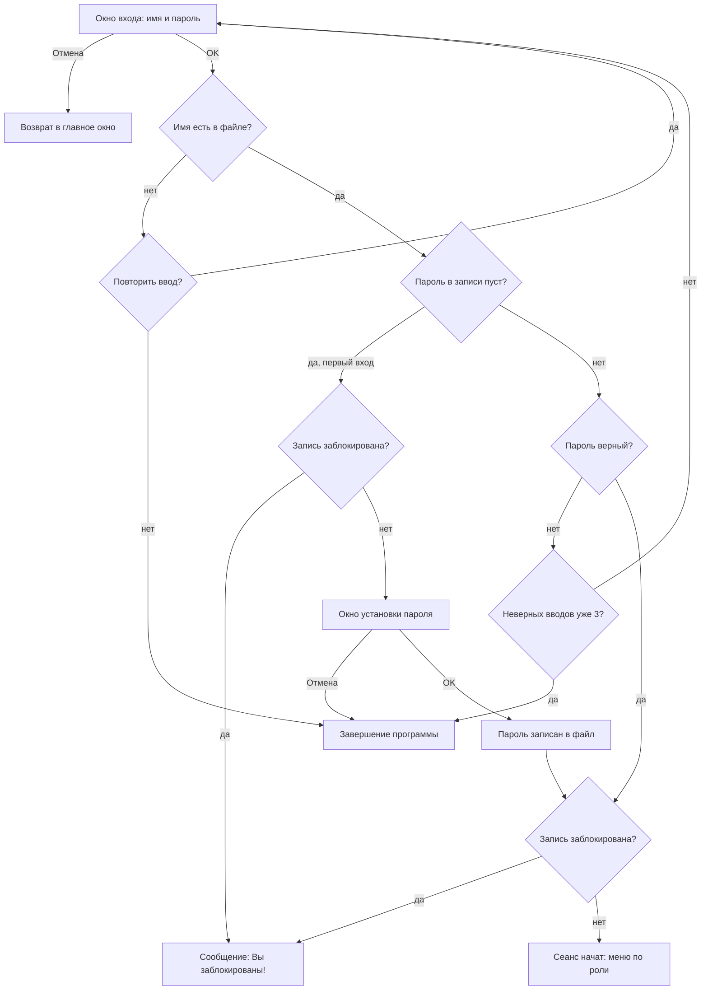
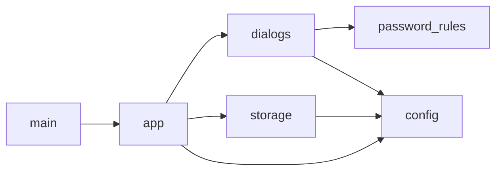

# Password Authentication

Настольное приложение на Python (tkinter) с разграничением полномочий пользователей на основе парольной аутентификации. Есть два режима работы: администратор (пользователь с фиксированным именем `ADMIN`) и обычный пользователь. Сведения об учётных записях хранятся в бинарном файле.

## Содержание

1. [Возможности](#возможности)
2. [Запуск](#запуск)
3. [Быстрый старт](#быстрый-старт)
4. [Интерфейс](#интерфейс)
5. [Правила входа и сообщения](#правила-входа-и-сообщения)
6. [Политика паролей](#политика-паролей)
7. [Архитектура](#архитектура)
8. [Справочник по модулям и классам](#справочник-по-модулям-и-классам)
9. [Формат файла `security.db`](#формат-файла-securitydb)
10. [Безопасность](#безопасность)
11. [Как изменить или расширить](#как-изменить-или-расширить)
12. [Сценарий проверки](#сценарий-проверки)
13. [Ограничения текущей версии](#ограничения-текущей-версии)

---

## Возможности

### Режим администратора
- смена пароля администратора (с проверкой старого пароля);
- просмотр списка пользователей и их параметров (блокировка, парольное ограничение) по одному, с переходом к предыдущей и следующей записи;
- добавление нового пользователя с уникальным именем и пустым паролем;
- блокировка пользователя;
- включение и отключение ограничений на пароль пользователя;
- завершение работы.

### Режим обычного пользователя
- смена собственного пароля (с проверкой старого пароля);
- завершение работы.

Остальные пункты меню заблокированы.

### Доступность пунктов меню

| Пункт меню | До входа | Администратор | Обычный пользователь |
|---|---|---|---|
| Пользователи → Смена пароля | недоступен | доступен | доступен |
| Пользователи → Новый пользователь | недоступен | доступен | недоступен |
| Пользователи → Все пользователи | недоступен | доступен | недоступен |
| Пользователи → Выход | доступен | доступен | доступен |
| Справка → О программе | доступен | доступен | доступен |

---

## Запуск

Нужен Python 3.7 или новее с tkinter (используются `dataclasses` и стандартная библиотека, внешних зависимостей нет).

```bash
python main.py
```

Если tkinter не установлен (Linux):

```bash
sudo apt install python3-tk
```

При первом запуске автоматически создаётся файл `security.db` с одной записью — `ADMIN` с пустым паролем.

## Быстрый старт

1. Запустите `python main.py`.
2. Нажмите «Вход в систему», введите имя `ADMIN`, пароль оставьте пустым.
3. Программа попросит задать пароль. Введите его дважды, например `Admin1!`.
4. Через меню «Пользователи → Новый пользователь» добавьте пользователей. Каждый задаст свой пароль при первом входе.

---

## Интерфейс

### Главное окно
Меню «Пользователи» и «Справка», по центру кнопка «Вход в систему», внизу строка состояния. Пока никто не вошёл, там написано «Вход не выполнен», после входа — «Пользователь: <имя> (администратор | обычный пользователь)».

### Диалоговые окна

| Окно | Класс | Назначение | Результат |
|---|---|---|---|
| Вход в систему | `LoginDialog` | имя и пароль (символы заменяются на `*`) | `(имя, пароль)` или `None` |
| Установка пароля | `PasswordDialog(first=True)` | задать пароль при первом входе | новый пароль или `None` |
| Смена пароля | `PasswordDialog(ask_old=True)` | старый пароль, новый, подтверждение | новый пароль или `None` |
| Добавление пользователя | `AddUserDialog` | имя, блокировка, парольное ограничение | `(имя, блокировка, ограничения)` или `None` |
| Список пользователей | `UsersDialog` | просмотр и правка записей по одной | ничего (изменения пишутся в файл кнопкой «Сохранить») |

Все окна модальные: пока окно открыто, остальные недоступны. Клавиша Enter равна кнопке OK, Esc равна кнопке «Отмена».

---

## Правила входа и сообщения

### Алгоритм входа



### Сообщения программы

| Ситуация | Сообщение |
|---|---|
| Пустое имя при входе | «Введите имя пользователя.» |
| Имя не найдено | «Вы не зарегистрированы!» (кнопки «Повторить» и «Отмена»; «Отмена» завершает программу) |
| Неверный пароль | «Неверный пароль! Осталось попыток: N» |
| Третий неверный пароль | «Вход в программу невозможен!» и завершение программы |
| Учётная запись заблокирована | «Вы заблокированы!» |
| Неверный старый пароль | «Неверный старый пароль!» |
| Пароль и подтверждение различаются | «Пароли должны совпадать!» |
| Пустой новый пароль | «Пароль не может быть пустым!» |
| Слишком длинный пароль | «Пароль слишком длинный (максимум 32 символов).» |
| Пароль не соответствует политике | «Пароль не соответствует ограничениям!» и текст требований |
| Пустое имя нового пользователя | «Введите имя пользователя.» |
| Слишком длинное имя | «Имя слишком длинное (максимум 20 символов).» |
| Имя занято | «Пользователь <имя> уже зарегистрирован!» |
| Уход с несохранёнными изменениями в списке | «Сохранить изменения для «<имя>»?» (Да / Нет / Отмена) |
| Пароль изменён | «Пароль успешно изменён.» |
| Пользователь добавлен | «Пользователь <имя> добавлен. Пароль он задаст при первом входе.» |
| Учётная запись исчезла из файла | «Учётная запись не найдена.» |
| Файл не создаётся | «Не удалось создать файл учётных записей» и завершение программы |
| Файл повреждён | «Файл учётных записей повреждён.» |

### Что происходит при отказе от ввода пароля

| Контекст | Кнопка «Отмена» |
|---|---|
| Первый вход пользователя | программа завершается |
| Обычная смена пароля | смена отменяется, пароль остаётся прежним |

---

## Политика паролей

Если у учётной записи включено «Парольное ограничение», пароль должен содержать одновременно:

1. хотя бы одну **строчную** букву (латиницу или кириллицу);
2. хотя бы одну **прописную** букву (латиницу или кириллицу);
3. хотя бы один **знак препинания** (`` ! " # $ % & ' ( ) * + , - . / : ; < = > ? @ [ \ ] ^ _ ` { | } ~ `` и типографские `« » – — …`).

Цифры не требуются. Максимальная длина пароля — 32 символа, имени — 20 символов. Если ограничение у учётной записи выключено, принимается любой непустой пароль (в пределах длины).

Примеры:

| Пароль | Результат | Причина |
|---|---|---|
| `Abc!` | принят | есть строчные, прописные, знак препинания |
| `Пароль.` | принят | то же на кириллице |
| `abc!` | отклонён | нет прописной буквы |
| `ABC!` | отклонён | нет строчной буквы |
| `Abcd` | отклонён | нет знака препинания |
| `Abc123` | отклонён | нет знака препинания |

---

## Архитектура

### Структура проекта

```
password-authentication/
├── main.py            # точка входа
├── app.py             # главное окно: меню, вход в систему, команды меню
├── dialogs.py         # диалоговые формы
├── storage.py         # Account и AccountFile — работа с файлом учётных записей
├── password_rules.py  # проверка ограничений на пароль
├── config.py          # константы и сведения о программе
├── README.md
└── .gitignore
```

### Зависимости между модулями

Зависимости направлены в одну сторону, циклических импортов нет.



### Разделение ответственности

| Слой | Модули | Знает про tkinter |
|---|---|---|
| Данные | `storage.py`, `config.py` | нет |
| Правила | `password_rules.py` | нет |
| Интерфейс | `dialogs.py` | да |
| Приложение | `app.py`, `main.py` | да |

Модули без tkinter можно импортировать и проверять отдельно, без запуска окон.

---

## Справочник по модулям и классам

### `config.py`

Только константы, кода нет.

| Константа | Значение | Назначение |
|---|---|---|
| `AUTHOR` | строка | сведения об авторе для окна «О программе» |
| `VARIANT` | число | номер варианта для окна «О программе» |
| `VARIANT_TEXT` | строка | описание политики паролей для окна «О программе» |
| `SECFILE` | путь | файл учётных записей, лежит рядом с `config.py` |
| `ADMIN` | `"ADMIN"` | фиксированное имя администратора |
| `MAXNAME` | `20` | максимальная длина имени в символах |
| `MAXPASS` | `32` | максимальная длина пароля в символах |
| `MAX_ATTEMPTS` | `3` | число допустимых неверных вводов пароля |

Путь `SECFILE` строится от расположения самого файла (`os.path.abspath(__file__)`), поэтому не зависит от текущей папки терминала.

### `password_rules.py`

| Имя | Тип | Описание |
|---|---|---|
| `PUNCT` | `set[str]` | знаки препинания: `string.punctuation` плюс `« » – — …` |
| `REQUIREMENTS` | `str` | текст требований, показывается в окне смены пароля и в сообщении об ошибке |
| `check_password(pw: str) -> bool` | функция | `True`, если в пароле есть строчная буква, прописная буква и знак препинания |

Внутри `check_password` три независимых проверки через `any(...)`: прописная (`c.isalpha() and c.isupper()`), строчная (`c.isalpha() and c.islower()`) и знак препинания (`c in PUNCT`). Работает и для латиницы, и для кириллицы, так как использует методы строк Python.

### `storage.py`

#### Константы модуля

| Имя | Описание |
|---|---|
| `_REC` | `struct.Struct("<80si128s??")`, описание бинарной записи |
| `REC_SIZE` | размер записи в байтах (214) |

#### Класс `Account` (`@dataclass`)

Одна учётная запись.

| Поле | Тип | По умолчанию | Смысл |
|---|---|---|---|
| `name` | `str` | — | имя пользователя |
| `password` | `str` | `""` | пароль; пустая строка означает «ещё не входил» |
| `block` | `bool` | `False` | вход запрещён администратором |
| `restrict` | `bool` | `True` | к паролю применяется политика |

#### Класс `AccountFile(path)`

Доступ к файлу учётных записей. Хранит только путь, файл открывает на время каждой операции.

| Метод | Описание |
|---|---|
| `_pack(acc) -> bytes` | (статический) превращает `Account` в 214 байт: кодирует строки в UTF-8, длину пароля берёт как `len(password)` |
| `_unpack(chunk) -> Account` | (статический) обратное преобразование: убирает нулевые байты справа, декодирует UTF-8, обрезает пароль по записанной длине |
| `ensure_exists()` | если файла нет, создаёт его с одной записью `ADMIN` (пустой пароль, без блокировки, ограничения включены) |
| `read_all() -> list[Account]` | читает файл целиком и разбирает на записи. Если размер не кратен 214, бросает `ValueError("Файл учётных записей повреждён.")` |
| `find(name) -> (int, Account) \| None` | ищет запись по точному совпадению имени (с учётом регистра). Возвращает номер записи и саму запись |
| `write(index, acc)` | открывает файл в режиме `r+b`, переходит на позицию `index * 214` и перезаписывает только эту запись |
| `append(acc)` | дописывает запись в конец файла (режим `ab`) |

Номер записи из `find` нужен именно для `write`: так обновляется одна запись без переписывания всего файла.

### `dialogs.py`

#### Класс `Dialog(parent, title)` (наследует `tk.Toplevel`)

Базовый модальный диалог. Реализует общий шаблон, наследники переопределяют отдельные шаги.

| Атрибут | Описание |
|---|---|
| `parent` | родительское окно |
| `result` | результат диалога; `None`, если окно закрыли отменой |
| `initial_focus` | виджет, который получит фокус при открытии |

| Метод | Описание |
|---|---|
| `build(body)` | (переопределяется) создаёт поля ввода в рамке `body` |
| `validate() -> bool` | (переопределяется) проверяет ввод; `False` оставляет окно открытым |
| `apply()` | (переопределяется) записывает итог в `self.result` |
| `make_buttons()` | создаёт кнопки OK и «Отмена» (переопределяется, если нужны другие) |
| `on_ok()` | цепочка `validate` → `apply` → закрытие окна |
| `on_cancel()` | `result = None` и закрытие окна |
| `show()` | ждёт закрытия окна и возвращает `result` |

Как достигается модальность: `transient(parent)` привязывает окно к родителю, `wait_visibility()` дожидается его появления, `grab_set()` перехватывает весь ввод, `wait_window()` блокирует вызывающий код до закрытия. Окно центрируется по родителю. Крестик закрытия приравнен к «Отмене», Enter к OK, Esc к «Отмене».

#### Класс `LoginDialog(parent, name="")`

Окно входа.

- Поля: `e_name` (имя), `e_pass` (пароль, `show="*"`).
- Если передан `name`, он подставляется, а фокус ставится на пароль.
- `validate`: имя не должно быть пустым.
- `result`: `(имя, пароль)`. Имя очищается от пробелов по краям.

#### Класс `PasswordDialog(parent, account, ask_old, first=False)`

Установка и смена пароля.

| Параметр | Смысл |
|---|---|
| `account` | учётная запись, для которой меняется пароль (нужна для проверки старого пароля и флага `restrict`) |
| `ask_old` | показывать поле «Старый пароль» и проверять его |
| `first` | режим первого входа: заголовок «Установка пароля» и подсказка |

- Поля: `e_old` (только при `ask_old`), `e_new`, `e_conf`. Все со скрытием символов.
- Если у записи включено ограничение, под полями показываются требования к паролю.
- `validate` проверяет по порядку: старый пароль → совпадение с подтверждением → непустой → длина → политика паролей. При ошибке показывает сообщение и возвращает фокус в нужное поле.
- `_error(text, widget)`: показывает сообщение об ошибке, ставит фокус, возвращает `False`.
- `result`: новый пароль.

#### Класс `AddUserDialog(parent, store)`

Добавление пользователя.

- Поля: `e_name`, галочки `v_block` (по умолчанию выключена) и `v_restrict` (по умолчанию включена).
- `validate`: имя не пустое, не длиннее `MAXNAME`, не занято. Занятость проверяется без учёта регистра по всем записям из `store`.
- `result`: `(имя, блокировка, ограничения)`.

#### Класс `UsersDialog(parent, store)`

Просмотр и редактирование учётных записей по одной.

| Атрибут | Описание |
|---|---|
| `accounts` | снимок всех записей, прочитанный при открытии окна |
| `cur` | номер отображаемой записи |
| `v_name`, `v_block`, `v_restrict` | переменные полей формы |
| `c_block`, `lbl_pos`, `btn_prev`, `btn_next` | виджеты, которыми управляет код |

| Метод | Описание |
|---|---|
| `_load(i)` | показывает запись `i`: заполняет форму, блокирует «Предыдущий» на первой записи и «Следующий» на последней, отключает галочку блокировки для `ADMIN`, обновляет «Запись N из M» |
| `_dirty()` | `True`, если значения на форме отличаются от сохранённых |
| `save()` | переносит значения формы в запись и пишет её в файл |
| `_confirm_leave()` | при несохранённых изменениях спрашивает «Сохранить?». «Да» сохраняет, «Нет» откатывает форму, «Отмена» возвращает `False` и оставляет всё на месте |
| `go_prev()`, `go_next()` | переход между записями с проверкой `_confirm_leave` |
| `on_ok()` | закрытие окна с проверкой `_confirm_leave` |

Кнопка «Отмена» закрывает окно без вопросов. Записи, сохранённые кнопкой «Сохранить», остаются в файле. Администратора заблокировать нельзя: для него галочка «Блокировка» недоступна.

### `app.py`

#### Класс `App` (наследует `tk.Tk`)

Главное окно и вся логика сеанса.

| Атрибут | Описание |
|---|---|
| `store` | `AccountFile` с файлом `SECFILE` |
| `current` | имя вошедшего пользователя (`None` до входа) |
| `attempts` | число неверных вводов пароля с начала запуска |
| `menu_users` | меню «Пользователи» (нужно для включения и отключения пунктов) |
| `status` | строка состояния |
| `btn_login` | кнопка «Вход в систему» |

| Метод | Описание |
|---|---|
| `__init__()` | создаёт файл учётных записей, собирает меню, строку состояния, кнопку входа. При ошибке файловой системы показывает сообщение и завершает программу |
| `login()` | цикл входа (см. схему выше): диалог, поиск имени, первый вход, проверка пароля, счётчик попыток, проверка блокировки |
| `_start_session(acc)` | запоминает пользователя, обнуляет счётчик попыток, включает пункты меню по роли, скрывает кнопку входа, обновляет строку состояния |
| `change_password()` | заново читает запись из файла, открывает `PasswordDialog(ask_old=True)`, при успехе сохраняет пароль |
| `new_user()` | открывает `AddUserDialog`, дописывает запись с пустым паролем |
| `all_users()` | открывает `UsersDialog` |
| `about()` | показывает сведения из `config` (автор, вариант, описание политики) |
| `report_callback_exception(...)` | показывает необработанную ошибку в окне вместо тихого вывода в консоль |

Роль определяется по имени: `acc.name == ADMIN` даёт режим администратора. Счётчик `attempts` общий для всех имён: три неверных пароля подряд завершают программу независимо от того, под каким именем вводились.

### `main.py`

Создаёт `App()` и запускает главный цикл событий `mainloop()`.

---

## Формат файла `security.db`

Файл бинарный. Он состоит из записей фиксированного размера **214 байт** без заголовка. Поэтому размер файла всегда кратен 214, а число записей равно размер / 214.

| Поле | Тип | Размер | Описание |
|---|---|---|---|
| Имя | строка UTF-8, добивается нулями | 80 байт | до 20 символов |
| Длина пароля | `int32` (little-endian) | 4 байта | 0 — пароль не задан |
| Пароль | строка UTF-8, добивается нулями | 128 байт | до 32 символов |
| Блокировка | `bool` | 1 байт | 1 — вход запрещён |
| Ограничения | `bool` | 1 байт | 1 — действуют ограничения на пароль |

Формат `struct`: `<80si128s??`. Знак `<` задаёт порядок байт little-endian и отключает выравнивание, без него между полями появились бы пустые байты. Ширина текстовых полей взята с запасом: один символ в UTF-8 занимает до 4 байт (80 = 20 × 4, 128 = 32 × 4). Первая запись всегда `ADMIN`.

Изменение записи выполняется перезаписью только её байтов (`seek` на `номер × 214`), файл целиком не переписывается.

### Как посмотреть содержимое

Быстро, в терминале:

```bash
xxd security.db | head -20
strings security.db
```

Или скриптом `dump.py` (положить рядом с `security.db`):

```python
import struct

REC = struct.Struct("<80si128s??")

data = open("security.db", "rb").read()
print("Размер: %d байт, записей: %d\n" % (len(data), len(data) // REC.size))

for i in range(0, len(data), REC.size):
    name, passlen, pw, block, restrict = REC.unpack(data[i:i + REC.size])
    print("Запись %d:" % (i // REC.size + 1))
    print("  имя:         ", name.rstrip(b"\0").decode("utf-8"))
    print("  длина пароля:", passlen)
    print("  пароль:      ", pw.rstrip(b"\0").decode("utf-8"))
    print("  блокировка:  ", block)
    print("  ограничения: ", restrict)
```

---

## Безопасность

- Пароли хранятся в файле **в открытом виде**, без хеширования и шифрования. Это осознанное упрощение.
- Поэтому `security.db` внесён в `.gitignore`: не публикуйте его в репозитории.
- Администратора нельзя заблокировать (иначе управлять программой станет некому).
- Имена пользователей уникальны без учёта регистра (нельзя создать `admin`, если есть `ADMIN`). При входе имя сравнивается с учётом регистра.
- Счётчик неверных вводов пароля живёт только в памяти запущенной программы и сбрасывается при перезапуске, поэтому перебор паролей ничем не ограничен.
- Программа не защищает файл от прямого редактирования.

---

## Как изменить или расширить

| Задача | Что менять |
|---|---|
| Сменить политику паролей | `check_password` и `REQUIREMENTS` в `password_rules.py` |
| Изменить лимиты длины или число попыток | `MAXNAME`, `MAXPASS`, `MAX_ATTEMPTS` в `config.py` |
| Сменить имя файла с учётными записями | `SECFILE` в `config.py` |
| Изменить данные в «О программе» | `AUTHOR`, `VARIANT`, `VARIANT_TEXT` в `config.py` |
| Добавить поле в запись пользователя | поле в `Account`, формат `_REC`, методы `_pack` и `_unpack` в `storage.py` |
| Перейти на другой способ хранения (JSON, SQLite) | заменить реализацию `AccountFile` с теми же методами: остальной код менять не придётся |
| Хешировать пароли | хешировать при записи в `PasswordDialog.apply` или `App`, сравнивать хеши в `App.login`, увеличить `MAXPASS`-поле под длину хеша |
| Новый диалог | наследоваться от `Dialog` и переопределить `build`, `validate`, `apply` |

При изменении формата записи существующий `security.db` станет нечитаемым. Удалите его, и программа создаст новый.

---

## Сценарий проверки

1. Удалите `security.db` и запустите программу. Файл создастся заново размером 214 байт.
2. Нажмите «Вход в систему», введите `ADMIN` с пустым паролем и задайте пароль, например `Admin1!`.
3. Через «Пользователи → Новый пользователь» добавьте несколько пользователей. Проверьте отказы: пустое имя, дубликат (`ADMIN` и `admin`), имя длиннее 20 символов.
4. Через «Пользователи → Все пользователи» просмотрите записи кнопками «Предыдущий» и «Следующий», заблокируйте одного пользователя, отключите ограничения у другого, сохраните.
5. Смените пароль администратора: неверный старый пароль, разные пароли, пароль без ограничений (`abc`), затем корректный.
6. Перезапустите программу. Проверьте отказы при входе: несуществующее имя, три неверных пароля подряд.
7. Войдите обычным пользователем: первый вход с установкой пароля (`abc123` и `abc!` отклоняются, `Abc!` принимается), в меню доступны только «Смена пароля» и «Выход».
8. Войдите заблокированным пользователем: «Вы заблокированы!».
9. Откройте «Справка → О программе».

---

## Ограничения текущей версии

- Сменить пользователя без перезапуска программы нельзя: после входа кнопка «Вход в систему» скрывается.
- Окно входа открывается по кнопке, а не автоматически при запуске.
- Файл читается целиком при каждой операции. Для небольшого числа пользователей это незаметно, для тысяч записей потребуется другая схема доступа.
- Автоматических тестов в проекте нет.
