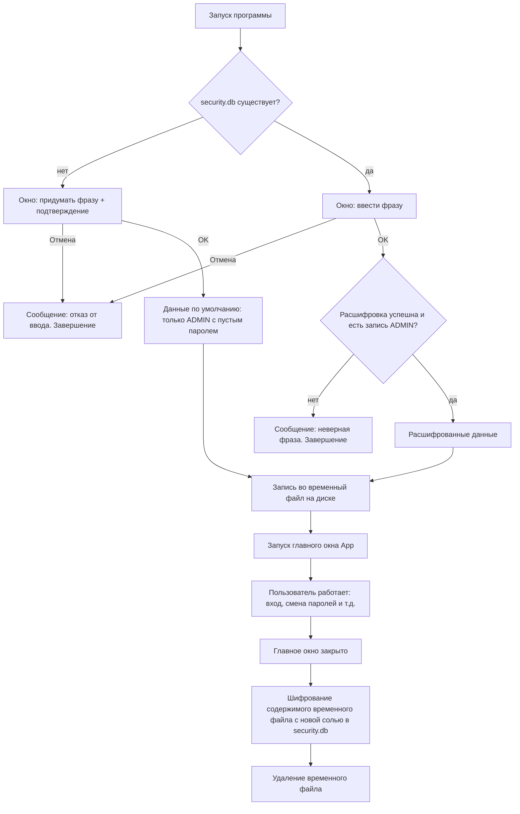
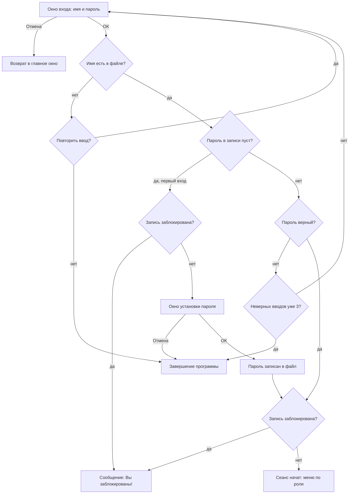
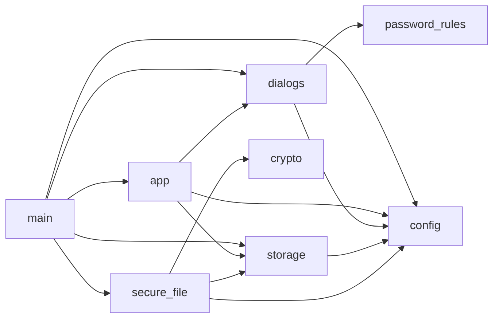

# Password Authentication

Настольное приложение на Python (tkinter) с разграничением полномочий пользователей на основе парольной аутентификации и шифрованием файла учётных данных. Есть два режима работы: администратор (пользователь с фиксированным именем `ADMIN`) и обычный пользователь. Файл с учётными записями хранится на диске в зашифрованном виде и открывается только по парольной фразе.

## Содержание

1. [Возможности](#возможности)
2. [Запуск](#запуск)
3. [Быстрый старт](#быстрый-старт)
4. [Интерфейс](#интерфейс)
5. [Парольная фраза и шифрование файла](#парольная-фраза-и-шифрование-файла)
6. [Правила входа и сообщения](#правила-входа-и-сообщения)
7. [Политика паролей](#политика-паролей)
8. [Архитектура](#архитектура)
9. [Справочник по модулям и классам](#справочник-по-модулям-и-классам)
10. [Формат файла `security.db`](#формат-файла-securitydb)
11. [Независимая проверка шифрования](#независимая-проверка-шифрования)
12. [Соответствие заданию](#соответствие-заданию)
13. [Безопасность](#безопасность)
14. [Как изменить или расширить](#как-изменить-или-расширить)
15. [Сценарий проверки](#сценарий-проверки)
16. [Ограничения текущей версии](#ограничения-текущей-версии)

---

## Возможности

### Режим администратора
- смена пароля администратора (с проверкой старого пароля);
- просмотр списка пользователей и их параметров (блокировка, парольное ограничение) по одному, с переходом к предыдущей и следующей записи;
- добавление нового пользователя с уникальным именем и пустым паролем;
- блокировка пользователя;
- включение и отключение ограничений на пароль пользователя;
- завершение работы.

### Режим обычного пользователя
- смена собственного пароля (с проверкой старого пароля);
- завершение работы.

Остальные пункты меню заблокированы.

### Доступность пунктов меню

| Пункт меню | До входа | Администратор | Обычный пользователь |
|---|---|---|---|
| Пользователи → Смена пароля | недоступен | доступен | доступен |
| Пользователи → Новый пользователь | недоступен | доступен | недоступен |
| Пользователи → Все пользователи | недоступен | доступен | недоступен |
| Пользователи → Выход | доступен | доступен | доступен |
| Справка → О программе | доступен | доступен | доступен |

---

## Запуск

Нужен Python 3.7 или новее с tkinter, и библиотека `cryptography` для шифрования файла.

Если tkinter не установлен (Linux):

```bash
sudo apt install python3-tk
```

### Установка зависимости

```bash
pip install -r requirements.txt
```

На Debian/Ubuntu (в том числе WSL) системный `pip` может отказаться ставить пакеты напрямую (`error: externally-managed-environment`). В этом случае — виртуальное окружение:

```bash
python3 -m venv venv
source venv/bin/activate      # Linux/macOS
venv\Scripts\activate         # Windows
pip install -r requirements.txt
```

Активировать окружение (`source venv/bin/activate`) нужно заново в каждой новой сессии терминала перед запуском программы. Папка `venv/` уже внесена в `.gitignore`.

### Запуск программы

```bash
python main.py
```

При первом запуске файла `security.db` ещё нет: программа попросит придумать и подтвердить парольную фразу, затем создаст файл с одной записью `ADMIN` с пустым паролем.

## Быстрый старт

1. Установите зависимость: `pip install -r requirements.txt`.
2. Запустите `python main.py`.
3. Придумайте и подтвердите парольную фразу — она защищает весь файл `security.db`.
4. В открывшемся главном окне нажмите «Вход в систему», введите имя `ADMIN`, пароль оставьте пустым.
5. Программа попросит задать пароль администратора. Введите его дважды, например `Admin1!`.
6. Через меню «Пользователи → Новый пользователь» добавьте пользователей. Каждый задаст свой пароль при первом входе.
7. Выйдите через «Пользователи → Выход» — важно именно так: на этом шаге программа шифрует файл с учётом всех изменений (см. раздел ниже).

---

## Интерфейс

### Главное окно
Меню «Пользователи» и «Справка», по центру кнопка «Вход в систему», внизу строка состояния. Пока никто не вошёл, там написано «Вход не выполнен», после входа — «Пользователь: <имя> (администратор | обычный пользователь)».

### Диалоговые окна

| Окно | Класс | Назначение | Результат |
|---|---|---|---|
| Парольная фраза | `PassphraseDialog` | фраза (и подтверждение — только при первом создании файла) | строка или `None` |
| Вход в систему | `LoginDialog` | имя и пароль (символы заменяются на `*`) | `(имя, пароль)` или `None` |
| Установка пароля | `PasswordDialog(first=True)` | задать пароль при первом входе | новый пароль или `None` |
| Смена пароля | `PasswordDialog(ask_old=True)` | старый пароль, новый, подтверждение | новый пароль или `None` |
| Добавление пользователя | `AddUserDialog` | имя, блокировка, парольное ограничение | `(имя, блокировка, ограничения)` или `None` |
| Список пользователей | `UsersDialog` | просмотр и правка записей по одной | ничего (изменения пишутся в файл кнопкой «Сохранить») |

Все окна модальные: пока окно открыто, остальные недоступны. Клавиша Enter равна кнопке OK, Esc равна кнопке «Отмена».

---

## Парольная фраза и шифрование файла

Перед тем как появится главное окно, программа запрашивает **парольную фразу** — отдельный секрет, который защищает *весь* файл `security.db`, а не отдельную учётную запись. Это отдельный уровень защиты поверх обычного входа по имени и паролю (раздел «Правила входа» ниже): сначала файл должен быть успешно расшифрован, и только потом становится доступным обычный вход `ADMIN`/пользователей.

### Что происходит при запуске


```mermaid
flowchart TD
    S[Запуск программы] --> E{security.db существует?}
    E -->|нет| N["Окно: придумать фразу + подтверждение"]
    N -->|Отмена| X1["Сообщение: отказ от ввода. Завершение"]
    N -->|OK| D0["Данные по умолчанию: только ADMIN с пустым паролем"]
    E -->|да| P["Окно: ввести фразу"]
    P -->|Отмена| X1
    P -->|OK| L{"Расшифровка успешна и есть запись ADMIN?"}
    L -->|нет| X2["Сообщение: неверная фраза. Завершение"]
    L -->|да| D1["Расшифрованные данные"]
    D0 --> T["Запись во временный файл на диске"]
    D1 --> T
    T --> R["Запуск главного окна App"]
    R --> M["Пользователь работает: вход, смена паролей и т.д."]
    M --> C["Главное окно закрыто"]
    C --> W["Шифрование содержимого временного файла с новой солью в security.db"]
    W --> DEL["Удаление временного файла"]
```

### Сообщения о парольной фразе

| Ситуация | Сообщение | Что дальше |
|---|---|---|
| Файла ещё нет, фразы не совпадают при подтверждении | «Парольные фразы не совпадают!» | окно остаётся открытым |
| Пустая фраза | «Введите парольную фразу.» | окно остаётся открытым |
| Отказ от ввода (Отмена/Esc) | «Отказ от ввода парольной фразы.\nРабота программы завершена.» | программа завершается, файл не создаётся и не изменяется |
| Неверная фраза при существующем файле | «Неверная парольная фраза!\nРабота программы завершена.» | программа завершается немедленно, без повторных попыток |

В отличие от пароля пользователя, у парольной фразы **нет счётчика попыток**: одна ошибка — и работа сразу завершается. Так требует задание лабы №3 (п. 5).

### Временный файл

Пока программа работает, все операции (`AccountFile.read_all`, `find`, `write`, `append`) идут с **расшифрованным** временным файлом на диске (создаётся через `tempfile.mkstemp`, обычно в `/tmp` на Linux или `%TEMP%` на Windows). Сам `App` ничего не знает о шифровании — ему просто передаётся путь к этому временному файлу, и он работает с ним так же, как в лабе №1.

После того как главное окно закрывается (`App.mainloop()` возвращает управление — неважно, через «Выход» или штатное закрытие), `main.py`:

1. читает актуальное содержимое временного файла;
2. шифрует его заново, с **новой случайной солью**, и перезаписывает `security.db` целиком (старое содержимое стирается);
3. удаляет временный файл с диска.

Если программа завершилась досрочно (неверная фраза, отказ от ввода, ошибка создания файла), ни один из этих трёх шагов не выполняется — `security.db` остаётся как было.

---

## Правила входа и сообщения

Всё в этом разделе относится к обычному входу (имя + пароль пользователя) и происходит уже после того, как парольная фраза принята (см. предыдущий раздел).

### Алгоритм входа


```mermaid
flowchart TD
    A[Окно входа: имя и пароль] -->|Отмена| Z1[Возврат в главное окно]
    A -->|OK| B{Имя есть в файле?}
    B -->|нет| C{Повторить ввод?}
    C -->|да| A
    C -->|нет| X[Завершение программы]
    B -->|да| D{Пароль в записи пуст?}
    D -->|да, первый вход| E{Запись заблокирована?}
    E -->|да| Z2[Сообщение: Вы заблокированы!]
    E -->|нет| F[Окно установки пароля]
    F -->|Отмена| X
    F -->|OK| G[Пароль записан в файл]
    D -->|нет| H{Пароль верный?}
    H -->|нет| I{Неверных вводов уже 3?}
    I -->|да| X
    I -->|нет| A
    H -->|да| J{Запись заблокирована?}
    G --> J
    J -->|да| Z2
    J -->|нет| K[Сеанс начат: меню по роли]
```

### Сообщения программы

| Ситуация | Сообщение |
|---|---|
| Пустое имя при входе | «Введите имя пользователя.» |
| Имя не найдено | «Вы не зарегистрированы!» (кнопки «Повторить» и «Отмена»; «Отмена» завершает программу) |
| Неверный пароль | «Неверный пароль! Осталось попыток: N» |
| Третий неверный пароль | «Вход в программу невозможен!» и завершение программы |
| Учётная запись заблокирована | «Вы заблокированы!» |
| Неверный старый пароль | «Неверный старый пароль!» |
| Пароль и подтверждение различаются | «Пароли должны совпадать!» |
| Пустой новый пароль | «Пароль не может быть пустым!» |
| Слишком длинный пароль | «Пароль слишком длинный (максимум 32 символов).» |
| Пароль не соответствует политике | «Пароль не соответствует ограничениям!» и текст требований |
| Пустое имя нового пользователя | «Введите имя пользователя.» |
| Слишком длинное имя | «Имя слишком длинное (максимум 20 символов).» |
| Имя занято | «Пользователь <имя> уже зарегистрирован!» |
| Уход с несохранёнными изменениями в списке | «Сохранить изменения для «<имя>»?» (Да / Нет / Отмена) |
| Пароль изменён | «Пароль успешно изменён.» |
| Пользователь добавлен | «Пользователь <имя> добавлен. Пароль он задаст при первом входе.» |
| Учётная запись исчезла из файла | «Учётная запись не найдена.» |
| Файл не создаётся | «Не удалось создать файл учётных записей» и завершение программы |
| Файл повреждён | «Файл учётных записей повреждён.» |

### Что происходит при отказе от ввода пароля

| Контекст | Кнопка «Отмена» |
|---|---|
| Первый вход пользователя | программа завершается |
| Обычная смена пароля | смена отменяется, пароль остаётся прежним |

---

## Политика паролей

Если у учётной записи включено «Парольное ограничение», пароль должен содержать одновременно:

1. хотя бы одну **строчную** букву (латиницу или кириллицу);
2. хотя бы одну **прописную** букву (латиницу или кириллицу);
3. хотя бы один **знак препинания** (`` ! " # $ % & ' ( ) * + , - . / : ; < = > ? @ [ \ ] ^ _ ` { | } ~ `` и типографские `« » – — …`).

Цифры не требуются. Максимальная длина пароля — 32 символа, имени — 20 символов. Если ограничение у учётной записи выключено, принимается любой непустой пароль (в пределах длины).

Примеры:

| Пароль | Результат | Причина |
|---|---|---|
| `Abc!` | принят | есть строчные, прописные, знак препинания |
| `Пароль.` | принят | то же на кириллице |
| `abc!` | отклонён | нет прописной буквы |
| `ABC!` | отклонён | нет строчной буквы |
| `Abcd` | отклонён | нет знака препинания |
| `Abc123` | отклонён | нет знака препинания |

---

## Архитектура

### Структура проекта

```
password-authentication/
├── main.py              # точка входа: парольная фраза, расшифровка, запуск App, шифрование обратно
├── app.py                # главное окно: меню, вход в систему, команды меню
├── dialogs.py             # диалоговые формы, включая окно парольной фразы
├── storage.py              # Account, AccountFile, parse_accounts, default_data
├── password_rules.py        # проверка ограничений на пароль
├── crypto.py                 # шифрование: соль, ключ из MD5, AES в режиме ECB
├── secure_file.py              # чтение/сохранение зашифрованного security.db
├── config.py                    # константы и сведения о программе
├── verify_variant13.py           # независимая проверка параметров шифрования
├── requirements.txt
├── README.md
└── .gitignore
```

### Зависимости между модулями


```mermaid
flowchart LR
    main --> app
    main --> secure_file
    main --> storage
    main --> dialogs
    main --> config
    app --> dialogs
    app --> storage
    app --> config
    dialogs --> password_rules
    dialogs --> config
    storage --> config
    secure_file --> crypto
    secure_file --> storage
    secure_file --> config
```

### Разделение ответственности

| Слой | Модули | Знает про tkinter |
|---|---|---|
| Данные | `storage.py`, `config.py` | нет |
| Криптография | `crypto.py`, `secure_file.py` | нет |
| Правила | `password_rules.py` | нет |
| Интерфейс | `dialogs.py` | да |
| Приложение | `app.py`, `main.py` | да |

`crypto.py` и `secure_file.py` не используют tkinter и работают с обычными `bytes`/`str`, поэтому их можно проверять отдельно, не запуская окна — именно так сделано в `verify_variant13.py`.

---

## Справочник по модулям и классам

### `config.py`

Только константы, кода нет.

| Константа | Значение | Назначение |
|---|---|---|
| `AUTHOR` | строка | сведения об авторе для окна «О программе» |
| `VARIANT` | `13` | вариант задания лабы №1 (политика паролей) |
| `VARIANT_TEXT` | строка | описание политики паролей для окна «О программе» |
| `LAB3_VARIANT` | `13` | вариант задания лабы №3 (шифрование файла) |
| `LAB3_VARIANT_TEXT` | строка | описание схемы шифрования для окна «О программе» |
| `ENCFILE` | путь | зашифрованный файл учётных записей (`security.db`), лежит рядом с `config.py` |
| `ADMIN` | `"ADMIN"` | фиксированное имя администратора |
| `MAXNAME` | `20` | максимальная длина имени (в символах) |
| `MAXPASS` | `32` | максимальная длина пароля (в символах) |
| `MAX_ATTEMPTS` | `3` | число допустимых неверных вводов пароля пользователя (у парольной фразы счётчика нет) |

`ENCFILE` — тот же файл, что в лабе №1 назывался `SECFILE`, но теперь в нём хранятся не сами записи напрямую, а зашифрованные данные (см. раздел [«Формат файла»](#формат-файла-securitydb)).

### `password_rules.py`

| Имя | Тип | Описание |
|---|---|---|
| `PUNCT` | `set[str]` | знаки препинания: `string.punctuation` плюс `« » – — …` |
| `REQUIREMENTS` | `str` | текст требований, показывается в окне смены пароля и в сообщении об ошибке |
| `check_password(pw: str) -> bool` | функция | `True`, если в пароле есть строчная буква, прописная буква и знак препинания |

### `storage.py`

#### Константы и функции модуля

| Имя | Описание |
|---|---|
| `_REC` | `struct.Struct("<80si128s??")`, описание бинарной записи |
| `REC_SIZE` | размер записи в байтах (214) |
| `_pack(acc) -> bytes` | превращает `Account` в 214 байт |
| `_unpack(chunk) -> Account` | обратное преобразование |
| `parse_accounts(data: bytes) -> list[Account]` | разбирает произвольные байты (не обязательно файл) на список записей; бросает `ValueError`, если длина не кратна 214 |
| `default_data() -> bytes` | 214 байт одной записи `ADMIN` с пустым паролем — используется и для создания нового файла, и в `main.py` при первом запуске (до шифрования) |

`_pack`/`_unpack` — функции модуля, а не статические методы `AccountFile`: так их может использовать и `secure_file.py` без создания объекта `AccountFile`.

#### Класс `Account` (`@dataclass`)

| Поле | Тип | По умолчанию | Смысл |
|---|---|---|---|
| `name` | `str` | — | имя пользователя |
| `password` | `str` | `""` | пароль; пустая строка означает «ещё не входил» |
| `block` | `bool` | `False` | вход запрещён администратором |
| `restrict` | `bool` | `True` | к паролю применяется политика |

#### Класс `AccountFile(path)`

| Метод | Описание |
|---|---|
| `ensure_exists()` | если файла нет, создаёт его с `default_data()` |
| `read_all() -> list[Account]` | читает файл целиком, разбор делегирует `parse_accounts` |
| `find(name) -> (int, Account) \| None` | ищет запись по точному совпадению имени (с учётом регистра) |
| `write(index, acc)` | перезаписывает только одну запись (`seek` на `index * 214`) |
| `append(acc)` | дописывает запись в конец файла |

### `crypto.py` (новое в лабе №3)

Формирование ключа и собственно шифрование/расшифрование. Не использует tkinter, не читает и не пишет файлы — только преобразует байты.

| Имя | Описание |
|---|---|
| `SALT_SIZE` | `16` — размер соли в байтах |
| `BLOCK_BITS` | `128` — размер блока AES в битах (16 байт), нужен для настройки PKCS7-дополнения |
| `generate_salt() -> bytes` | `os.urandom(16)` — случайное значение, добавляемое к ключу |
| `derive_key(passphrase, salt) -> bytes` | ключ = `MD5(passphrase.encode("utf-8") + salt)`. Длина MD5-дайджеста (16 байт) ровно совпадает с длиной ключа AES-128 |
| `encrypt_bytes(data, key) -> bytes` | дополняет данные по PKCS7 и шифрует AES в режиме ECB |
| `decrypt_bytes(data, key) -> bytes` | расшифровывает AES-ECB и снимает дополнение; при неверном ключе дополнение почти всегда некорректно, и Python выбрасывает `ValueError` |

Эти четыре функции реализуют вариант 13: **блочный** шифр (AES), режим **ECB** («Электронная кодовая книга»), **соль**, добавляемая к ключу, и хеш-функция **MD5**.

### `secure_file.py` (новое в лабе №3)

Чтение и сохранение зашифрованного файла целиком.

| Функция | Описание |
|---|---|
| `load(path, passphrase) -> bytes \| None` | читает файл, отделяет первые 16 байт (соль) от шифротекста, вычисляет ключ, пытается расшифровать и разобрать записи через `storage.parse_accounts`. Возвращает `None`, если расшифровка не удалась, данные повреждены, или среди записей нет `ADMIN` |
| `save(path, passphrase, plain_data)` | генерирует новую соль, вычисляет ключ, шифрует `plain_data` и **перезаписывает** файл целиком |

`load` — единственное место в проекте, где проверяется «правильность введённой парольной фразы», и делает это так, как требует задание: не сравнением самой фразы, а по тому, нашлась ли в расшифрованных данных запись администратора (п. 4 задания лабы №3).

### `dialogs.py`

#### Класс `Dialog(parent, title)` (наследует `tk.Toplevel`)

Базовый модальный диалог. Модальность достигается через `transient(parent)` + `wait_visibility()` + `grab_set()` + `wait_window()`. Крестик закрытия приравнен к «Отмене», Enter — к OK, Esc — к «Отмене».

#### Класс `PassphraseDialog(parent, prompt, confirm=False)` (новое в лабе №3)

Окно запроса парольной фразы («Form6» из методички).

- Поле `e_pass` (всегда, символы скрыты).
- Если `confirm=True` (при создании нового файла), добавляется поле `e_conf` — подтверждение.
- `validate`: фраза не пустая; если `confirm=True` — совпадает с подтверждением.
- `result`: введённая фраза или `None`.

#### Класс `LoginDialog(parent, name="")`

Окно входа. `result`: `(имя, пароль)` или `None`.

#### Класс `PasswordDialog(parent, account, ask_old, first=False)`

Установка и смена пароля. `validate` проверяет по порядку: старый пароль → совпадение с подтверждением → непустой → длина → политика паролей.

#### Класс `AddUserDialog(parent, store)`

Добавление пользователя. `result`: `(имя, блокировка, ограничения)` или `None`.

#### Класс `UsersDialog(parent, store)`

Просмотр и редактирование учётных записей по одной, с кнопками «Предыдущий»/«Следующий» и подтверждением при уходе с несохранёнными изменениями.

### `app.py`

#### Класс `App(secfile)` (наследует `tk.Tk`)

В отличие от лабы №1, конструктор принимает путь `secfile` — это **временный расшифрованный** файл, который подготовил `main.py`. Сам `App` ничего не знает о шифровании и работает с этим файлом в точности как в лабе №1.

| Метод | Описание |
|---|---|
| `__init__(secfile)` | создаёт `AccountFile(secfile)`, собирает меню, строку состояния, кнопку входа |
| `login()` | цикл входа: диалог, поиск имени, первый вход, проверка пароля, счётчик попыток, проверка блокировки |
| `_start_session(acc)` | включает пункты меню по роли, скрывает кнопку входа, обновляет строку состояния |
| `change_password()`, `new_user()`, `all_users()` | команды меню администратора/пользователя |
| `about()` | показывает автора и **оба** варианта: `VARIANT`/`VARIANT_TEXT` (лаба №1) и `LAB3_VARIANT`/`LAB3_VARIANT_TEXT` (лаба №3) |
| `report_callback_exception(...)` | показывает необработанную ошибку в окне вместо тихого вывода в консоль |

Заголовок главного окна — `"Работы №1,3"`.

### `main.py` (переписан в лабе №3)

Теперь это оркестратор всего процесса: парольная фраза → расшифровка → работа программы → шифрование обратно.

| Функция | Описание |
|---|---|
| `_ask_passphrase(root, prompt, confirm=False)` | обёртка над `PassphraseDialog(...).show()` |
| `main()` | вся логика запуска — см. схему в разделе [«Парольная фраза и шифрование файла»](#парольная-фраза-и-шифрование-файла) |

Важная деталь реализации: временное окно-родитель (`root = tk.Tk()`) **не скрывается через `withdraw()`** — вместо этого ему задаётся маленький размер и позиция примерно по центру экрана (`root.geometry(...)`). Причина: некоторые оконные менеджеры (в частности, под WSLg) не показывают диалоговое окно, если оно `transient` по отношению к полностью скрытому родителю — программа в таком случае зависает на `wait_visibility()` без единой ошибки в консоли.

---

## Формат файла `security.db`

Файл состоит из двух частей:

```
[ 16 байт — соль ][ шифротекст (AES-128, режим ECB) ]
```

- **Соль** (`crypto.SALT_SIZE = 16` байт) хранится открытым текстом. Это нормально: сама по себе соль не раскрывает содержимое, она нужна только для того, чтобы по одной и той же парольной фразе на каждом запуске получался один и тот же ключ.
- **Шифротекст** — результат `crypto.encrypt_bytes(plain, key)`, где `plain` — обычные 214-байтные записи `Account`, выровненные по границе 16 байт дополнением PKCS7. Длина шифротекста всегда кратна 16.
- Внутри расшифрованных данных формат записей **точно такой же**, как в лабе №1:

| Поле | Тип | Размер | Описание |
|---|---|---|---|
| Имя | строка UTF-8, добивается нулями | 80 байт | до 20 символов |
| Длина пароля | `int32` (little-endian) | 4 байта | 0 — пароль не задан |
| Пароль | строка UTF-8, добивается нулями | 128 байт | до 32 символов |
| Блокировка | `bool` | 1 байт | 1 — вход запрещён |
| Ограничения | `bool` | 1 байт | 1 — действуют ограничения на пароль |

Формат `struct`: `<80si128s??`, 214 байт на запись. При каждом сохранении (`secure_file.save`) генерируется новая случайная соль, поэтому даже если внутри ничего не поменялось, байты файла на диске будут другими после каждого выхода из программы.

### Почему старый `dump.py` больше не работает напрямую

`dump.py` из лабы №1 читает файл как голые 214-байтные записи. Теперь первые байты файла — это случайная соль, а остальное — шифротекст, так что `dump.py` на реальном `security.db` либо упадёт, либо выдаст мусор. Рабочий вариант — сначала расшифровать файл парольной фразой, и только потом разбирать записи:

```python
import getpass
import secure_file
import storage
from config import ENCFILE

passphrase = getpass.getpass("Парольная фраза: ")
plain = secure_file.load(ENCFILE, passphrase)

if plain is None:
    print("Неверная парольная фраза или файл повреждён.")
else:
    for i, a in enumerate(storage.parse_accounts(plain), 1):
        print("Запись %d: %s, пароль=%r, блокировка=%s, ограничения=%s" %
              (i, a.name, a.password, a.block, a.restrict))
```

Быстрая проверка, что файл действительно зашифрован (без расшифровки — просто смотрим, что он не читается как текст):

```bash
xxd security.db | head -5
strings security.db
```

`strings` не должен показать ни `ADMIN`, ни что-либо осмысленное — только случайные байты. Если бы файл не был зашифрован, имя `ADMIN` было бы видно сразу в начале вывода.

---

## Независимая проверка шифрования

Мало доверять комментариям в коде — в проекте есть отдельный скрипт `verify_variant13.py`, который проверяет параметры шифрования **независимо** от `crypto.py` и `secure_file.py`: он сам, вручную, через `hashlib` и `cryptography`, читает настоящий `security.db` и пытается его расшифровать теми же формулами, что описаны в задании. Если расшифровка срабатывает — это прямое доказательство, что файл соответствует варианту 13, а не просто «мы так написали в комментарии».

Запуск:

```bash
python verify_variant13.py
```

Скрипт спрашивает парольную фразу и печатает:

1. **Соль** — первые 16 байт файла, в hex.
2. **Длину шифротекста** и то, что она кратна 16 (признак блочного шифра с фиксированным размером блока).
3. **Ключ**, вычисленный как `MD5(фраза + соль)` — вручную, той же формулой, что описана в задании для варианта 13.
4. **Успешную расшифровку** реальных данных этим ключом и факт, что среди них есть запись `ADMIN`.
5. **Признак режима ECB**: скрипт шифрует тестовые данные вида `A×16 + B×16 + A×16` (первый и третий 16-байтные блоки одинаковы) тем же ключом и показывает, что 1-й и 3-й блоки шифротекста тоже совпали. Это возможно только в ECB, где каждый блок шифруется независимо от остальных — в CBC или CFB соседние блоки влияют друг на друга, и одинаковый открытый текст почти никогда не даёт одинаковый шифротекст. Такое совпадение — однозначный «отпечаток» именно режима ECB.

Если фраза введена неверно, скрипт сообщит об этом и завершится (`ValueError` при снятии PKCS7-дополнения) — так же, как сама программа.

Пример реального вывода (фраза и значения свои на каждом запуске):

```
=== Проверка файла security.db ===
Соль (16 байт): f54a8b3983e4eee76c7319b29b3d8aec
Длина шифротекста: 432 байт
Кратна 16 (размер блока AES): True

Ключ, полученный через MD5(фраза + соль): 7015a75406f5429460af1d18524560fb

Расшифровано успешно: 428 байт
В данных есть запись ADMIN: True

=== Проверка режима ECB ===
Блок 1 == Блок 3 (одинаковый открытый текст -> одинаковый шифротекст): True
Это свойство специфично для ECB и не выполняется для CBC/CFB.
```

---

## Соответствие заданию

### Лаба №3: 8 пунктов задания

| № | Требование | Где в коде |
|---|---|---|
| 1 | Добавить защиту файла поверх программы лабы №1 | `main.py` оборачивает тот же `App`, не меняя его логику входа |
| 2 | Шифрование сеансовым ключом, формируемым из вводимой парольной фразы | `crypto.derive_key(passphrase, salt)` |
| 3 | При запуске файл расшифровывается во временный файл; после работы — шифруется заново, старое содержимое стирается | `tempfile.mkstemp` в `main.py`; `secure_file.save` перезаписывает `ENCFILE` целиком |
| 4 | Верность фразы определяется по наличию записи ADMIN в расшифрованных данных | `secure_file.load`: `any(a.name == ADMIN for a in accounts)` |
| 5 | Неверная фраза или отказ от ввода — завершение с сообщением | оба случая обрабатываются в `main()`, без повторных попыток |
| 6 | Временный файл удаляется после завершения работы | `finally: os.remove(temp_path)` в `main()` |
| 7 | Конкретные алгоритмы — по варианту (вариант 13: блочный / ECB / соль / MD5) | `crypto.py` целиком: `algorithms.AES`, `modes.ECB()`, `generate_salt()`, `hashlib.md5` |
| 8 | Для Паскаля — `wincrypt.pas` | не относится, проект на Python |

Пункт 7 отдельно подтверждён не только по коду, но и независимым пересчётом — см. [«Независимая проверка шифрования»](#независимая-проверка-шифрования).

### Замена CryptoAPI

Методичка описывает интерфейс CryptoAPI, специфичный для Windows. Поскольку проект на Python, функции заменены стандартными открытыми средствами:

| Из методички (CryptoAPI) | В проекте |
|---|---|
| `CryptCreateHash` + `CryptHashData` (хеширование фразы) | `hashlib.md5` |
| `CryptDeriveKey` с `CRYPT_CREATE_SALT` | `crypto.derive_key` — ключ = хеш(фраза + случайная соль) |
| `CryptEncrypt` / `CryptDecrypt` | библиотека `cryptography` — `Cipher(algorithms.AES(key), modes.ECB())` |
| `TMemoryStream` / нетипизированный файл | `tempfile` — временный расшифрованный файл на диске |
| Form6 (окно парольной фразы) | `PassphraseDialog` в `dialogs.py` |

---

## Безопасность

- Файл `security.db` на диске **зашифрован целиком** (вариант 13: AES-ECB, ключ из MD5(фраза+соль)). Без знания парольной фразы прочитать его нельзя.
- Пока программа работает, расшифрованные данные лежат **только во временном файле** (в системной временной папке), который удаляется сразу после закрытия главного окна — даже если программа закрылась из-за ошибки (блок `finally` в `main.py`).
- Внутри расшифрованных данных пароли пользователей по-прежнему хранятся как обычные строки (как в лабе №1) — шифруется весь файл целиком, отдельного хеширования паролей пользователей поверх этого нет.
- `security.db` и возможные временные файлы (`security_*.tmp`) внесены в `.gitignore`: не публикуйте их в репозитории, даже с учётом шифрования.
- Администратора нельзя заблокировать.
- Имена пользователей уникальны без учёта регистра.
- Счётчик неверных вводов пароля пользователя сбрасывается при перезапуске. У парольной фразы счётчика вообще нет — одна ошибка завершает программу.
- Смены самой парольной фразы в проекте нет: она задаётся один раз при создании файла и остаётся той же, пока файл не удалить и не создать заново.

---

## Как изменить или расширить

| Задача | Что менять |
|---|---|
| Сменить политику паролей | `check_password` и `REQUIREMENTS` в `password_rules.py` |
| Изменить лимиты длины или число попыток | `MAXNAME`, `MAXPASS`, `MAX_ATTEMPTS` в `config.py` |
| Сменить имя зашифрованного файла | `ENCFILE` в `config.py` |
| Изменить данные в «О программе» | `AUTHOR`, `VARIANT`, `VARIANT_TEXT`, `LAB3_VARIANT`, `LAB3_VARIANT_TEXT` в `config.py` |
| Добавить поле в запись пользователя | поле в `Account`, формат `_REC`, функции `_pack`/`_unpack` в `storage.py` |
| Перейти на другой способ хранения (JSON, SQLite) | заменить реализацию `AccountFile` с теми же методами |
| Сменить алгоритм шифрования файла | `algorithms.AES` в `crypto.py` → другой алгоритм из `cryptography.hazmat.primitives.ciphers.algorithms` |
| Сменить режим шифрования (например, на CBC) | `modes.ECB()` в `crypto.py` → `modes.CBC(iv)`; потребуется также хранить и передавать вектор инициализации (IV) рядом с солью |
| Сменить хеш-функцию для ключа | `hashlib.md5` в `derive_key` → `hashlib.sha1`/`sha256`; при другой длине дайджеста проверить совместимость с размером ключа шифра |
| Изменить размер соли | `SALT_SIZE` в `crypto.py` (его же использует `secure_file.py`) |
| Добавить смену парольной фразы | новый диалог по образцу `PasswordDialog`: расшифровка текущим ключом и шифрование новым (новая соль + новый `derive_key`) |

При изменении формата записи или схемы шифрования существующий `security.db` станет нечитаемым. Удалите его, и программа создаст новый.

---

## Сценарий проверки

### Лаба №3: парольная фраза и шифрование

1. Удалите `security.db`, если есть, и запустите `python main.py`. Должно открыться окно «Парольная фраза» с **двумя** полями (фраза + подтверждение).
2. Проверьте отказы: разные фразы в полях → «Парольные фразы не совпадают!»; пустая фраза → «Введите парольную фразу.».
3. Задайте фразу, например `MoyaFraza.1`. Должно открыться обычное главное окно лабы №1.
4. Пройдите обычный сценарий лабы №1 (см. ниже), затем выйдите через «Пользователи → Выход».
5. Убедитесь, что файл зашифрован: `strings security.db` не должен показать `ADMIN` или что-либо читаемое.
6. Убедитесь, что временный файл удалён: в `/tmp` (или `%TEMP%`) не должно остаться файлов `security_*.tmp`.
7. Запустите программу заново, введите ту же фразу — должно открыться главное окно с теми же пользователями и паролями, что были при выходе.
8. Запустите ещё раз с заведомо неверной фразой — «Неверная парольная фраза!» и немедленное завершение, без повторных попыток.
9. Запустите ещё раз и нажмите «Отмена» в окне парольной фразы — «Отказ от ввода парольной фразы.» и завершение.
10. Откройте «Справка → О программе» — должны быть оба варианта: про пароли и про шифрование.
11. (необязательно) Запустите `python verify_variant13.py` и убедитесь, что все проверки проходят.

### Лаба №1: обычный сценарий (внутри уже открытой программы)

1. Нажмите «Вход в систему», введите `ADMIN` с пустым паролем и задайте пароль, например `Admin1!`.
2. Через «Пользователи → Новый пользователь» добавьте несколько пользователей. Проверьте отказы: пустое имя, дубликат (`ADMIN` и `admin`), имя длиннее 20 символов.
3. Через «Пользователи → Все пользователи» просмотрите записи кнопками «Предыдущий» и «Следующий», заблокируйте одного пользователя, отключите ограничения у другого, сохраните.
4. Смените пароль администратора: неверный старый пароль, разные пароли, пароль без ограничений (`abc`), затем корректный.
5. Выйдите и перезапустите программу (с той же парольной фразой). Проверьте отказы при входе: несуществующее имя, три неверных пароля подряд.
6. Войдите обычным пользователем: первый вход с установкой пароля (`abc123` и `abc!` отклоняются, `Abc!` принимается), в меню доступны только «Смена пароля» и «Выход».
7. Войдите заблокированным пользователем: «Вы заблокированы!».

---

## Ограничения текущей версии

- Сменить пользователя без перезапуска программы нельзя: после входа кнопка «Вход в систему» скрывается.
- Окно входа (имя+пароль) открывается по кнопке, а не автоматически при запуске главного окна; окно парольной фразы, наоборот, открывается автоматически перед главным окном.
- Смены парольной фразы нет: она задаётся один раз при создании файла.
- Файл читается целиком при каждой операции. Для небольшого числа пользователей это незаметно.
- Автоматических тестов в проекте нет.